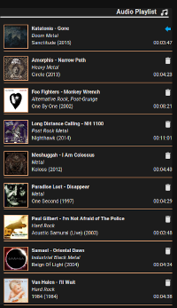
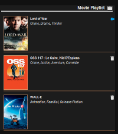

# Kodi-Playlist-Card

This card displays the playlist running on the kodi entity. The refresh is automatic based on events triggered by the entity.

This card is intented to be an alternative to an iframe containing Chorus.

| Audio Playlist | Audio Playlist | Video Playlist |
| ---- | ---- | ---- |
|  |  |  |

## Requirements

This card requires a specific sensor that gets the data from Kodi. The sensor is provided by the custom component [Kodi Media Sensors](https://github.com/jtbgroup/kodi-media-sensors). Keep this integration up to date to avoid strange behaviour of your card.

## Features

The card will let you track the playlist of kodi.
You can perform some actions directly from the card like removing an item from the playlist or play a specific entry in the playlist.

## Installation

1. Install the custom component [Kodi Media Sensors](https://github.com/jtbgroup/kodi-media-sensors).
2. Install the card using HACS

Manual installation is of course possible, but not explained here.

## Card options

| Name | Type | Default | Since | Description |
|------|------|---------|-------|-------------|
| type | string	| **required** | v1.0.0 | `custom:kodi-playlist-card` |
| entity | string | **required** | v1.0.0 |  `sensor.kodi_playlist` |
| title | string | optional | v1.0.0 | The title of the card |
| show_thumbnail | boolean | `false` | v1.1.2 | Set to true if you want to show the thumbnails coming from kodi. Attention you can get problems when mixing http and https content; if so, leave it to false. |
| show_thumbnail_overlay| boolean | `true` | v3.1 | When true, adds an lightgrey overlay above the thumbnail; this might be useful to see better the play icon displayed above the thumbnail.
| show_thumbnail_border | boolean | `false` | v3.1 | When true, adds a 1px border around the thumbnails.
| show_line_separator | boolean | `true` | v3.3 | When true, adds a 1 px border under each item of the playlist.
| outline_color | string | optional default: `white` | v3.1 | This option is to use in combination with other properties (**show_thumbnail_border** and **show_line_separator**). The color can be a string (ex: 'white', 'red', 'green', ... ), rgb format (ex: 'rgb(10, 12, 250)') or hexa format (ex: '#EE22FF').

**No need to pass the entity of the Kodi player as it is embedded in the data of the sensor.**